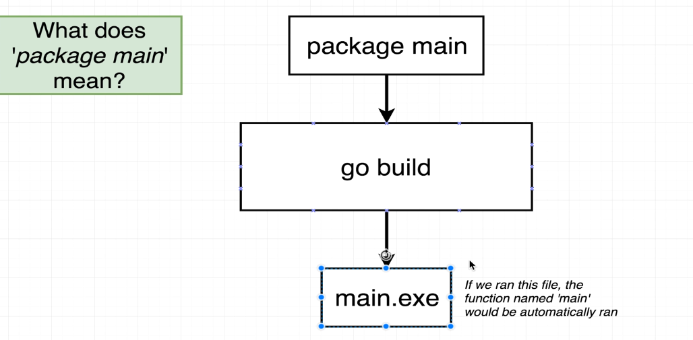

# Go Language Basics: Compilation and Packages

## Go Commands

### `go run`
- Used to compile and execute a bunch of files together
- Quick way to test and run Go programs

### `go build`
- Compiles the source code
- Creates an executable file
- Allows you to run the program separately from compilation

## Packages in Go

A Package is a collection of related source code files. 

### Package Rules
- Every file must have `package [packagename]` as the first line
- Two main types of packages:
  1. **Executable Packages**
     - Creates a runnable program
     - Must have a `main` package with a `main()` function
     - Can be converted into an executable binary

     
  
  2. **Reusable Packages**
     - Contains helper functions, utilities
     - Any name other than 'main' in package name   
     - Cannot be directly executed
     - Meant to be imported by other packages

### Example Package Structure
```go
// In main.go
package main  // Executable package

func main() {
    // Entry point of the program
}

// In helper.go
package helper  // Reusable package

func HelperFunction() {
    // Utility function
}