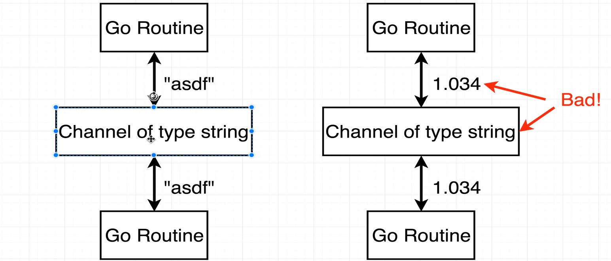
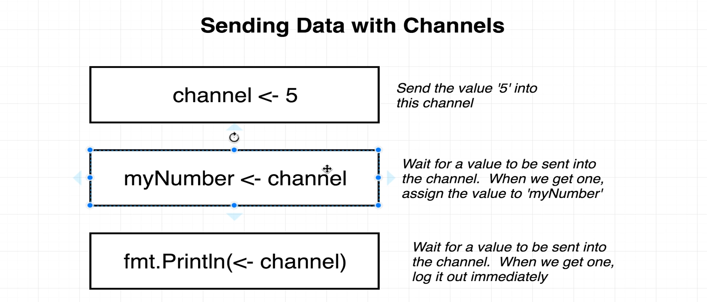

day#12
    - Go Routines and Channels
        - When we run our program it automatically creates a go routine
        - It executed it by one by one
        - http call is called a blocking call
        - If we write go before the function which has the blocking code , then , that function runs in another go routine.
        - Go try taking just one CPU and the scheduler switches between the go routines according to the blocking calls
        
        - When we have multiple CPUs , the schedular assigns one go routine to each CPU. But at one time , only one go routine will run in one CPU
        
        - Concurrency is not parallelism : Concurrency is when a CPU can run mulitple routines , not at the same time though , but the switching time is so low that it gets the feel that they are almost running parallelly. When parallelism is multiple routines running at the exact same time.
        - We can only use 'go' keyword in front of function calls
        - Channels communicate between different go routines.
        - If we dont use channels , the main go routines has no way to know , when the child routines finishes their tasks. Or for that matter , no 2 childs know about each other as well.
        - Channels are typed.
        
        - Creating a new channel : c := make(chan string)
        - Sending data to channel
        
        - Sending message to a channel => channel<-45
        -  Receiving message from a channel => var<-channel
        -  Receiving message from the channel acts as a blocker code as the routine where we are receiving the message sits there and wait to get some info.