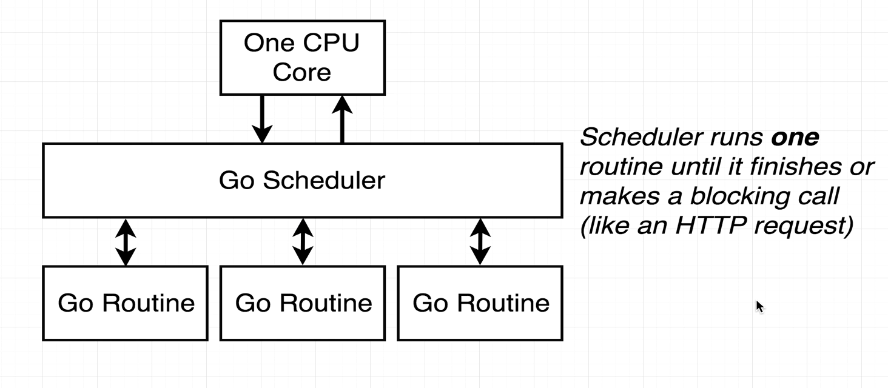
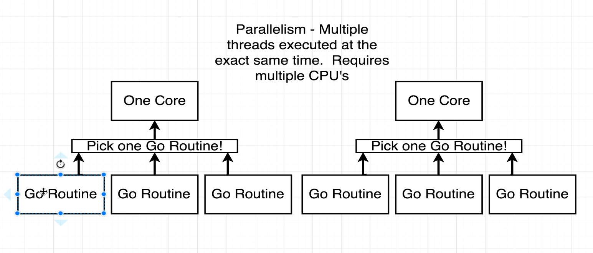

Here is the README.md file for day #12 of your Go learning, covering Go Routines and Channels:

# Day #12 - Go Routines and Channels

This day we learned about Go Routines and Channels in Golang.

## Go Routines
- When we run our program, it automatically creates a Go routine.
- The program executes these Go routines one by one.
- An HTTP call is a blocking call, meaning the program waits for the response before moving to the next line.
- If we write `go` before a function that has blocking code, that function runs in a separate Go routine.
- When we have just one CPU, the scheduler switches between the Go routines according to the blocking calls.



- When we have multiple CPUs, the scheduler assigns one Go routine to each CPU. However, at any given time, only one Go routine will run on a single CPU.



- Concurrency is not the same as parallelism. Concurrency is when a CPU can run multiple routines, not at the same time, but the switching time is so low that it gives the feel of almost running parallelly. Parallelism is when multiple routines are running at the exact same time.
- We can only use the `go` keyword in front of function calls to create a new Go routine.

## Channels
- Channels are used to communicate between different Go routines.
- If we don't use channels, the main Go routine has no way to know when the child routines finish their tasks, and the child routines have no way to communicate with each other.
- Channels are typed, meaning we can only send and receive data of the same type through a channel.

Creating a new channel:
```go
c := make(chan string)
```

Sending data to a channel:
```go
channel <- 45
```

Receiving data from a channel:
```go
var <- channel
```

Receiving a message from a channel acts as a blocking code, as the routine where we are receiving the message sits and waits to get the information.