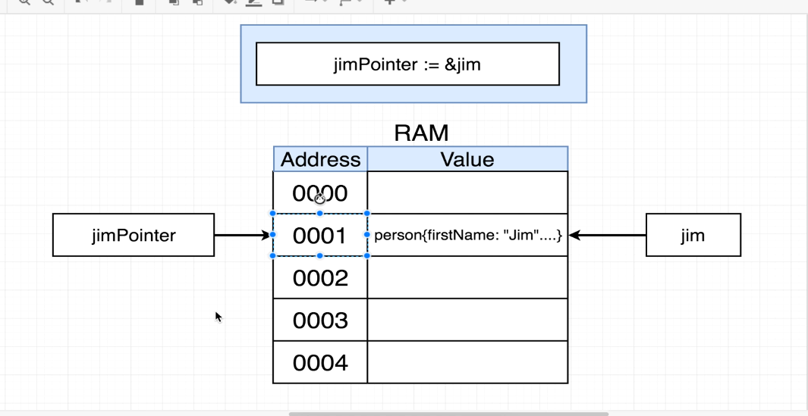
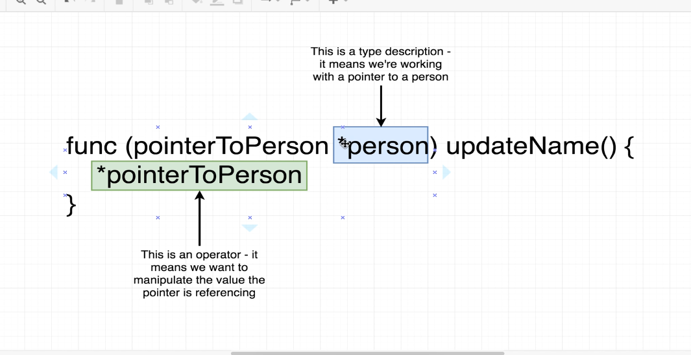
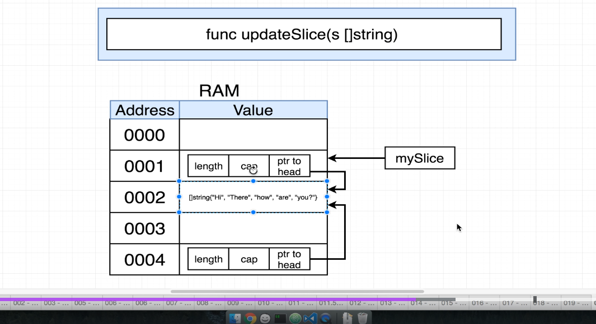
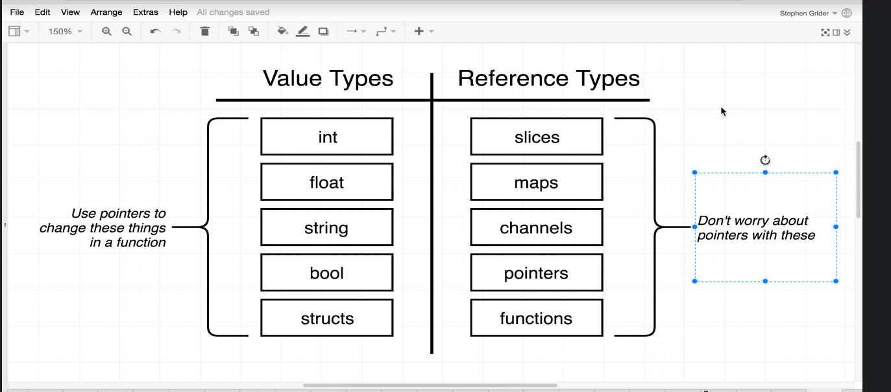

Day#7

- Pointers in go
    - Pass by value used by golang
    - Pointer Operations , and how it acts as a work around to the Pass by value property
    - & and * operator
    
    

    - Shortcut use of pointers
    - When we pass a slice , we are actually passing the reference , we dont use & sign
    
    - Other data structures that behaves similar to slices are maps , channels , pointers , functions
    